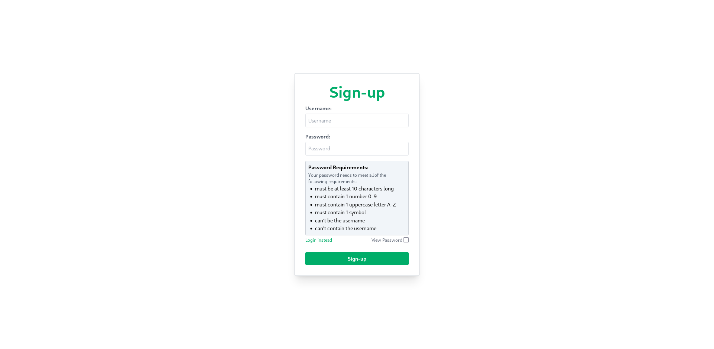

# Idea

> GitHub project page: [https://github.com/xnacly/private.social](https://github.com/xnacly/private.social)

Private.social is a revolutionary social network that aims to put privacy and security at the forefront of its design.
It is a platform where users can create an account without having to provide their email address or phone number, thereby keeping their personal information safe from prying eyes.

One of the most unique features of Private.social is that all accounts are set to private visibility by default, meaning that only those who follow a user can see their profile data and posts.
This ensures that users have complete control over who can access their content and who can't.
Additionally, Private.social stores passwords in the database hashed with bcrypt, making it extremely difficult for hackers to access them.

In order to further safeguard user data, Private.social secures all API interactions with JWT tokens.
This adds an extra layer of security, ensuring that only authorized users can access the API.
Password requirements are also enforced, with a minimum of 10 characters, at least one symbol, one uppercase character, and one number, making it extremely difficult for anyone to guess a user's password.

The platform also offers a number of non-privacy related features.
For instance, users can create posts with captions and choose whether to allow likes and comments.
They can also choose who can comment on their posts.
Profiles on Private.social can include a text biography, profile picture, website, location, and more.
This allows users to create a personalized profile that reflects their unique personality.

Private.social also includes a number of mental health-related features, such as the ability to restrict and disable likes and comments.
Users can also block, mute, and report others.
Posts can be reported as well, making it a safe and supportive platform for all users.
These features are especially important given the impact that social media can have on mental health, and Private.social is committed to making sure that its users feel safe and supported at all times.

Overall, Private.social is an innovative and user-friendly social network that prioritizes privacy and security.
Its unique features make it stand out from other social media platforms, and its commitment to mental health is commendable.
Whether you're looking to share your thoughts and ideas with the world or simply connect with like-minded individuals, Private.social is the perfect platform for you.

# Features and their status

Privacy related features:

-   [x] Create an account without requiring an email address or phone number.
    -   [ ] Optionally add an email address to the account to enable resetting the account password.
-   [x] Set all accounts to private visibility by default.
        (Only followers can view profile data and posts from a private account.)
-   [x] Secure all API interactions with JWT tokens.
-   [x] Store passwords in the database hashed with bcrypt.
-   [x] Enforce password requirements:
    -   [x] Minimum of 10 characters.
    -   [x] At least one symbol.
    -   [x] At least one uppercase character.
    -   [x] At least one number.

Non-privacy related features:

-   [x] Self-hostable API, CDN, and web.
-   [ ] Home view sorted chronologically.
-   [x] Posts:
    -   [ ] Likes:
        -   [ ] Private (only the creators can see the number of likes).
        -   [ ] Disable (no one can like the post).
    -   [ ] Comments:
        -   [ ] Restricted (only followers can comment).
        -   [ ] Mention-only (only mentioned users can comment).
        -   [ ] Disable (no one can comment).
    -   [x] Caption.
    -   [ ] Collaboration on posts.
-   [x] Profile:
    -   [x] Biography:
        -   [x] Text biography.
        -   [ ] Custom pronouns.
        -   [x] Profile picture.
        -   [ ] Profile banner.
        -   [x] Website.
        -   [x] Location.
    -   [ ] Customize profile using CSS.

Mental health related features:

-   [ ] Likes and comments can be restricted and disabled.
-   [ ] Users can be blocked, muted, and reported.
-   [ ] Posts can be reported.

# Motivation

Private.social was developed during the 4th semester of our applied computer science bachelor's program by the following four individuals:

-   [9525469](https://github.com/xnacly)
-   [9197785](https://github.com/ellirynbw)
-   [8478190](https://github.com/derPhilosoff)
-   [1823169](https://github.com/noschnosch)

The objective of the semester's examination was to create and document an application that utilizes at least two microservices.
One microservice had to be programmed by our group, while the other could be any publicly available online web service.
To earn a mark higher than "good," the group had to create either a frontend web application or a mobile application.
The task also required the groups to document the application interfaces with OpenAPI and keep track of which member was responsible for which task.

At Private.social, we utilize three microservices that we programmed ourselves:

-   **api**: This service allows the web frontend to interact with the database.
-   **cdn**: This service is responsible for storing assets.
-   **web**: This service governs the web interface.

We also utilize one microservice as a database:

-   **mongo**: This service is responsible for storing all user and post data.

In addition, we use one external service:

-   **[ui.avatars](https://ui-avatars.com/)**: This service is used to provide new users with a default profile picture.

# Task distribution

| Teammember | Task                                       |
| ---------- | ------------------------------------------ |
| 9525469    | Web and API implementation, docs           |
| 9197785    | Docker, Nginx and mongodb setup, docs      |
| 8478190    | Docs, API database wrapper, config package |
| 1823169    | CDN, docs and web design                   |

## Statistics:

In sum, the team spent ca. 250 hours working on this project. After completing the project, around 300 commits, 4400 LOC (lines of code), 900 lines of documentation and 1880 lines of Open API documentation have amassed.

For a quick summary, take a look at the following [cloc](https://github.com/AlDanial/cloc) output:

```console
$ cloc . --vcs=git
Language                     files          blank        comment           code
-------------------------------------------------------------------------------
YAML                             5            186              0           1876
TypeScript                      22             67             79           1355
Go                              21            245             99           1039
Markdown                         5            315              0            903
JSON                             3              0              0             56
Dockerfile                       3              3              0             25
JavaScript                       2              0              1             18
HTML                             1              1             10             13
Bourne Shell                     1              2              1             10
TeX                              1              1              0              5
CSS                              1              0              0              3
-------------------------------------------------------------------------------
SUM:                            65            820            190           5303
```

Or the total changes made to the git project:

```terminal
$ git count-lines
added lines: 11564, removed lines: 4962, total lines: 6602
```

> `count-lines` alias taken from [stack-overflow](https://stackoverflow.com/questions/1265040/how-to-count-total-lines-changed-by-a-specific-author-in-a-git-repository)

# Processes

# Project architecture

{height=200px; width=200px}

# Project structures

The following chapter is a short summary of the projects directories and what path contains what part of the business logic.

## Repository structure

This project is structured into four main directories:

-   `web/`: This folder contains the front-end portion of the application, which is built with React.js.
-   `api/`: This directory contains the back-end of the application, which is built with Go.
-   `cdn/`: This folder contains the content delivery network of the application, which is built with Go. The CDN serves pictures and videos.
-   `docs/`: This folder contains the documentation for the project.

## CDN

The cdn is started via `go run .` which downloads all the dependencies the go compiler needs to create a executable.
After starting, the cdn checks if the directory `./vfs` exists, if not it creates the directory.
The next step is a custom error handler which returns a `ApiResponse` go structure to the user, which translated to the following json object:

```json
{
    "success": false,
    "code": 404,
    "message": "Not Found",
    "data": null
}
```

This structure supports errors (as showcased above) and successful responses, such as:

```json
{
    "success": true,
    "code": 201,
    "message": "file uploaded successfully",
    "data": {
        "path": "/v1/asset/LHGyWsDknFdttJFzhHCprZHUhekCTTWH/dGVzdC5wbmdx"
    }
}
```

This response structure is also used in the `api` project to keep things consistent.

The cdn uses and registers the [cors](https://docs.gofiber.io/api/middleware/cors/), [cache](https://docs.gofiber.io/api/middleware/cache/) and [logger](https://docs.gofiber.io/api/middleware/logger/) middleware, all provided by the [fiber](https://gofiber.io/) web server framework.
The first one is used to insure cross origin resource sharing, the second one is used to aggressively cache assets uploaded to the cdn and the third allows for verbose event logging, which is incredibly helpful for debugging.

After the middlewares are registered, the cdn groups the two available routes using the `v1` group, which enables the routing using a prefix.
This is useful for versioning and supporting outdated routes, while innovating.

The first of the two routes is used to upload a file `/v1/upload/:file`.
It only accepts incoming requests if the `file` parameter and the request body are not empty. After a request was made, the cdn first determines the MIME type of the incoming binary request body and checks if it's a supported MIME type:

-   image/png
-   image/jpg
-   image/jpeg
-   image/gif
-   image/webp
-   image/heic
-   video/mp4

If this isn't the case, the cdn responds with an error in the format of the `ApiResponse` go structure.
If the mime type is supported, the cdn creates a random directory prefix and creates a new directory with this name.
To prevent vulnerabilities caused by file paths in the request parameter which try to escape the `vfs` directory, we use a go std lib function to only get the base of the filename.
This escaped filename is now converted to its base64 representation and stored as a file in the previously created directory.
If everything worked out as intended, the cdn returns the default `ApiResponse` structure with the data containing a `path` key value pair pointing to the uploaded assets:

```json
{
    "success": true,
    "code": 201,
    "message": "file uploaded successfully",
    "data": {
        "path": "/v1/asset/PXKjmgzuhCKOsxcFMxnEpZqSpTKTqNEF/dGVzdC5wbmdx"
    }
}
```

To request the uploaded asset, simply concatenate the returned path and the path the cdn is currently hosted at:

```js
"http://localhost:8080" +
    "/v1/asset/PXKjmgzuhCKOsxcFMxnEpZqSpTKTqNEF/dGVzdC5wbmdx";
```

The result, viewed in the browser:


The second available handler is bound to the `v1/asset` path and is a statically hosted directory mounted to the `vfs` directory.
Its cached with a max-age of 3600 seconds (60 min / 1h) and returns a 404 `ApiResponse` structure:

```json
{
    "success": false,
    "code": 404,
    "message": "Not Found",
    "data": null
}
```

### Directory content:

```text
drwxr-xr-x    - teo 10 Mar 14:47 .
.rw-r--r-- 1.3k teo  9 Mar 11:56 ├── app.go
.rw-r--r-- 4.5k teo  9 Mar 16:30 ├── cdn-openapi.yaml
.rw-r--r--  208 teo  6 Mar 10:35 ├── Dockerfile
.rw-r--r--  896 teo  6 Mar 10:35 ├── go.mod
.rw-r--r-- 6.3k teo  6 Mar 10:35 ├── go.sum
drwxr-xr-x    - teo  9 Mar 11:56 ├── handlers
.rw-r--r-- 1.5k teo  9 Mar 11:56 │  └── file.go
.rw-r--r--  106 teo  6 Mar 10:35 ├── Readme.md
drwxr-xr-x    - teo 13 Mar 08:49 ├── tests
.rw-r--r--  401 teo  6 Mar 10:35 │  └── util_test.go
drwxr-xr-x    - teo  9 Mar 11:56 ├── util
.rw-r--r-- 3.6k teo  9 Mar 11:56 │  └── util.go
drwxr-xr-x    - teo 13 Mar 08:49 └── vfs
```

-   app.go:

    This is the main entry point of the application, and contains middlewares and restful server setup. It is responsible for setting up the different routes that the CDN will expose, and for binding the upload handler to POST /v1/upload. Additionally, it serves the vfs directory statically with a max-age of 3600.

-   Documentation:

    The directory includes a CDN OpenAPI specification file, which describes the different endpoints of the CDN, and a Readme file, which provides information on how to use the CDN.

-   Dockerfile:

    This file is used to build a Docker image of the application. This is useful for deployment purposes, as it allows the application to be easily packaged and deployed on different platforms.

-   Dependency management for Go:

    go.sum and go.mod.
    These files are used to manage the different dependencies required by the application.

-   Handlers:

    This folder contains different handlers that are responsible for handling the different requests made to the CDN. The handlers are able to interact with the Fiber context, and act as routes for the CDN.

-   Tests:

    This folder contains unit tests for the util module.

-   Util:

    This folder contains a utility module for structs and small helper methods.

-   Vfs:

    This folder contains the directory that the CDN creates to store uploaded assets in.

## API

In a nutshell the api is the layer between the web interface and the database with a bit of access security.
The API is secured with usage of [JWT](https://www.rfc-editor.org/rfc/rfc7519) and is at the point of writing in no way complete for all features described at [idea](#idea).

As shown below, the api is a lot more structured and split up into modules than the cdn.
The api also requires a database connection which is fairly complex and therefore abstracted away with a custom database wrapper.

After being started the application looks for the `JWT_SECRET` and the `MONGO_URL` environment variables using the `config.LoadConfig` function, the former is used for signing jwt tokens when a user registers or logs in and the second is used to connect to the database.
If either of the above are not found in the process context the application throws a fatal error and exits.

After checking for the environment variables, the application calls the `setup.Setup` function,
which creates the application, registers middlewares (cache, logger, cors) and returns the created instance of an `fiber.App`.

This created application is now passed to the `router.RegisterRoutes` function, which creates all `router.Route` structs in the `router.UnauthenticatedRoutes` array.

Example for a `router.Route` struct and the function call to register it as a route:

```go
type Route struct {
	Path        string
	Method      string
	Handler     func(*fiber.Ctx) error
}

var Routes = []Route{
    {
		Path:        "/ping",
		Method:      "GET",
		Handler:     func (c *fiber.Ctx) error {
                        return c.JSON(util.ApiResponse{
                            Success: true,
                            Message: "pong",
                            Code:    200,
                            Data:    nil,
                        })
                    },
	},
}

app := setup.Setup()
RegisterRoutes(app, "v1", Routes...)
// running this prints:
// 2023/03/14 09:33:02 Registered route: [GET] v1/ping
```

The `router.RegisterRoutes` wrapper simplifies the registering of routes significantly.

Currently the only unauthenticated routes the api supports are the `/auth/login`, `/auth/register` and the `/ping` route.

To make all other routes only accept incoming requests if they contain a jwt in the `Authentication` http header,
the application registers the jwt middleware with a custom `SuccessHandler` which uses the `util.GetCurrentUser` function to query the database for the id embeded in the jwt. The resulting `models.User` struct is stored in the fiber context using the [ctx.Locals](https://docs.gofiber.io/api/ctx/#locals) function.

If the user couldn't be found by the `SuccessHandler` of the jwt middleware it returns the error response we already know from the cdn:

```json
{
    "success": false,
    "message": "Invalid token",
    "code": 401
}
```

After setting up the jwt middleware and therefore securing the application significantly,
the application now registers all the other `router.Route` structs in the `router.Routes` array and afterwards binds a `404` error handler to all routes not bound to anything beforehand.

### Workflow for adding a new Route

Adding a new route to the api requires the following two choices to make:

-   should it require authentication
-   what path should the route answer to

For the sake of this example, lets assume we want to add a hello world route to the path `/hello/world`, it doesn't need authentication and returns a simple json object.

To get started we create a new file in the `handlers` directory named `helloworld.go`, in this file we write the following function:

```go
// handlers/helloworld.go
package handlers

import (
	"github.com/xnacly/private.social/api/util"

	"github.com/gofiber/fiber/v2"
)

func HelloWorld(c *fiber.Ctx) error {
	return c.JSON(util.ApiResponse{
		Success: true,
		Message: "hello world",
		Code:    200,
	})
}
```

We of course need to import the fiber package for the context parameter in the function and we need to import our utility package to access our `util.ApiResponse` struct we use to keep the api responses consistent.

The response (if it has content) has the status of `200 OK`, we set the `util.ApiResponse.Code` to match this status (the better way is to use `fiber.StatusOk` which maps to 200). The `util.ApiResponse.Message` is set to the string `hello world` and the `util.ApiResponse.Success` is of course `true`.

Currently this route is not registered to the application and therefore won't accept any incoming requests. To change this we need to navigate to the `router` package and open the `router.go` file.

At the top, right after the imports you should see a `Route` structure, which looks something like this:

```go
// struct representing a route the api should handle and register
type Route struct {
	Path        string
	Method      string
	Handler     func(*fiber.Ctx) error
}
```

To add your route to the application, simply create a new `Route` structure in the `router.UnauthenticatedRoutes`:

```go
var UnauthenticatedRoutes = []Route{
    {
        Path: "/hello/world",
        Method: "GET",
        Handler: handlers.HelloWorld,
    },
    // ....
}
```

The `handler.HelloWorld` is automatically exported according to the go standard due to the uppercase function name.

Now simply restart the api and use curl to check if your route was registered:

```sh
curl --request GET \
  --url http://localhost:8000/v1/hello/world
# {"success":true,"code":200,"message":"hello world","data":null}
```

### Directory content:

```text
drwxr-xr-x    - teo 10 Mar 14:45 .
.rw-r--r--  106 teo  6 Mar 17:06 ├── .env
.rw-r--r--   23 teo  6 Mar 10:35 ├── .env.example
.rw-r--r-- 1.8k teo  6 Mar 10:35 ├── app.go
drwxr-xr-x    - teo  6 Mar 10:35 ├── config
.rw-r--r--  951 teo  6 Mar 10:35 │  └── config.go
drwxr-xr-x    - teo 10 Mar 08:00 ├── database
.rw-r--r-- 1.2k teo  9 Mar 16:30 │  ├── database.go
.rw-r--r-- 2.3k teo 10 Mar 08:00 │  ├── posts.go
.rw-r--r-- 2.4k teo  9 Mar 16:30 │  └── users.go
.rw-r--r--  208 teo  6 Mar 10:35 ├── Dockerfile
.rw-r--r-- 1.5k teo  6 Mar 10:35 ├── go.mod
.rw-r--r--  11k teo  6 Mar 10:35 ├── go.sum
drwxr-xr-x    - teo 10 Mar 15:10 ├── handlers
.rw-r--r-- 4.5k teo  7 Mar 13:02 │  ├── auth.go
.rw-r--r--  314 teo  9 Mar 16:30 │  ├── ping.go
.rw-r--r-- 3.5k teo 10 Mar 15:10 │  ├── post.go
.rw-r--r-- 2.8k teo  9 Mar 16:30 │  └── user.go
drwxr-xr-x    - teo  9 Mar 16:30 ├── models
.rw-r--r--  424 teo  9 Mar 16:30 │  ├── General.go
.rw-r--r--  716 teo  9 Mar 16:30 │  ├── Post.go
.rw-r--r-- 2.2k teo  6 Mar 10:35 │  └── User.go
.rw-r--r--  17k teo  9 Mar 16:30 ├── openapi3_0.yaml
.rw-r--r--  873 teo  6 Mar 10:35 ├── Readme.md
drwxr-xr-x    - teo 10 Mar 14:39 ├── router
.rw-r--r-- 2.5k teo 10 Mar 14:39 │  └── router.go
drwxr-xr-x    - teo  6 Mar 10:35 ├── setup
.rw-r--r-- 1.4k teo  6 Mar 10:35 │  └── setup.go
drwxr-xr-x    - teo  6 Mar 10:35 ├── tests
.rw-r--r--  418 teo  6 Mar 10:35 │  ├── config_test.go
.rw-r--r-- 1.6k teo  6 Mar 10:35 │  └── util_test.go
drwxr-xr-x    - teo  6 Mar 10:35 └── util
.rw-r--r-- 4.8k teo  6 Mar 10:35    └── util.go
```

The project is structured as follows:

-   app.go:

    This is the main entry point of the application, similar to the CDN. It is responsible for starting the server, and setting up the different routes that the API will expose.

-   Documentation:

    The project includes an OpenAPI specification file, which describes the different endpoints of the API, and a Readme file, which provides information on how to use the API.

-   Dockerfile:

    This file is used to build a Docker image of the application. This is useful for deployment purposes, as it allows the application to be easily packaged and deployed on different platforms.

-   Configuration:

    The project includes a .env file, which contains environment variables used by the application, and a .env.example file, which serves as an example of how to set up the environment variables.

-   Dependency management for Go:

    go.sum and go.mod.
    These files are used to manage the different dependencies required by the application.

-   Handlers: This folder contains different handlers that are responsible for handling the different requests made to the API. The handlers are able to interact with the Fiber context, and act as routes for the API. The handlers include:

    -   auth.go: Contains all routes used for authentication to the API.
    -   ping.go: Contains the ping route, which is used to check if the API is online.
    -   post.go: Contains uploading, viewing all posts by the logged in user, viewing a post by its ID, and deleting a post by its ID.
    -   user.go: Contains viewing the currently logged in user, viewing a user by their ID, and updating the currently logged in user.

-   Setup:

    This folder contains the module responsible for setting the error handler, registering the application, cors, cache and the logger

-   Config:

    This folder contains a module that is responsible for loading a dot env file, setting the defined environment variables in the process that the Go application is running in, and afterwards loading these environment variables in a config hashmap.

-   Database:

    This folder contains a module that is responsible for interacting with MongoDB. It includes a wrapper for creating the connection, managing users and posts.

-   Models:

    This folder contains structures for users, posts, and utility. These structures are used to encode from BSON to Go structures to JSON.

-   Tests:

    This folder contains tests for utility functions and the config module.

-   Util:

    This folder contains utility functions such as getting a timestamp for MongoDB, comparing object IDs, and getting the current user from the JWT token.

## Web

The web frontend is written using [Typescript](https://www.typescriptlang.org/), [React.js](https://reactjs.org/) as the Framework, [Vite](https://vitejs.dev/) as a bundler and dev server, [Tailwind](https://tailwindcss.com/) & [Postcss](https://postcss.org/) as the css framework and [react-router](https://reactrouter.com/en/main) as the routing provider.

The package manager for node is [pnpm](https://pnpm.io/), which is faster than its competitors and stores modules globally.

After being accessed the frontend application firstly makes sure if the api is accessable using the `web/src/util/fetch.xfetch` wrapper wrapped in the `web/src/util/util.isBackendAvailable` function:

```typescript
// web/util/fetch.ts
export async function xfetch(
    path: string,
    options: { body?: {}; method?: string; token?: string } = {}
): Promise<IResponse> {
    let response = await fetch(path, {
        body: options.body ? JSON.stringify(options.body) : null,
        method: options.method ?? "GET",
        signal: AbortSignal.timeout(5000),
        headers: {
            "Content-Type": "application/json",
            ...(options?.token && { Authorization: `Bearer ${options.token}` }),
        },
    });

    let json = await response.json();

    return json;
}

// web/util/util.ts
export async function isBackendAvailable(): Promise<boolean> {
    try {
        return (await xfetch(ROUTES.ping, {})).success;
    } catch {
        return false;
    }
}
```

If the `web/src/util/util.isBackendAvailable` function returns false, the frontend stops all operation and displays the following error message:


If the function returns true everything commences normally and the frontend displays a login page:


If the user does not have an account and wishes to sign up, clicking on the `Sign up instead` button redirects to the following Signup page:



\newpage

If the user however decides to login and an error occurs the web application displays the error in a box highlighted with a red background and border:


\newpage

After successfully logging in, the user can either change their profile picture by clicking on the image on the left of their username:


\newpage


or edit his profile by clicking the `edit` button:


\newpage

To upload a picture the user clicks the bright green `+ Upload` button in the top right of the screen, this opens the following input:


\newpage

After clicking the `Upload Post` the user selects a picture and is prompted to input a description and has the choice of either removing the photo and choosing a different one of creating the post:


\newpage

After the post is successfully created the post can be viewed by clicking on its preview in the profile screen, after that the following is displayed:


\newpage

As stated before, the routing is done by `react-router` which allows the application to route and redirect without reloading the page.

The main routing logic is located in the `web/src/App.tsx` file. This file exports the `App` function which contains a `Routes` react-router component which in it self includes a lot of `Route` components which tell the router to map certain routes to components.

For example:

```jsx
import {
    BrowserRouter as Router,
    Routes,
    Route,
    Navigate,
} from "react-router-dom";

export default function App() {
    return (
        <>
            <Router>
                <Routes>
                    <Route path="/profile" element={<Profile />} />
                    <Route path="/post/:postId" element={<Post />} />
                </Routes>
            </Router>
        </>
    );
}
```

The imported `Router` which is the alias for `BrowserRouter` is used to contain the whole routing logic.
The `Routes` component works like a switch case statement, it matches for the path specified and returns the component specified in the `element` property.

The example above renders the `Profile` component if the browser location matches the `/profile` string.
The second example showcases dynamic url parameters. A url parameter is prefixed with `:` and can be accessed in the Component using the [`useParams`](https://reactrouter.com/en/main/hooks/use-params) hook, like so:

```jsx
import { useParams } from "react-router-dom";

export default function Post() {
    const { postId } = useParams();

    return <>{postId}</>;
}
```

This renders the `postId` parameter.

The exported `App` function is then imported into the `web/src/main.tsx` file which renders the application into the `web/index.html` file

```typescript
import React from "react";
import ReactDOM from "react-dom/client";
import App from "./App";

console.info(`
┌──────────────────────────────────────────────────────────────────────────────────────────────────────────┐
│                                                                                                          │
│   ██████╗ ██████╗ ██╗██╗   ██╗ █████╗ ████████╗███████╗   ███████╗ ██████╗  ██████╗██╗ █████╗ ██╗        │
│   ██╔══██╗██╔══██╗██║██║   ██║██╔══██╗╚══██╔══╝██╔════╝   ██╔════╝██╔═══██╗██╔════╝██║██╔══██╗██║        │
│   ██████╔╝██████╔╝██║██║   ██║███████║   ██║   █████╗     ███████╗██║   ██║██║     ██║███████║██║        │
│   ██╔═══╝ ██╔══██╗██║╚██╗ ██╔╝██╔══██║   ██║   ██╔══╝     ╚════██║██║   ██║██║     ██║██╔══██║██║        │
│   ██║     ██║  ██║██║ ╚████╔╝ ██║  ██║   ██║   ███████╗██╗███████║╚██████╔╝╚██████╗██║██║  ██║███████╗   │
│   ╚═╝     ╚═╝  ╚═╝╚═╝  ╚═══╝  ╚═╝  ╚═╝   ╚═╝   ╚══════╝╚═╝╚══════╝ ╚═════╝  ╚═════╝╚═╝╚═╝  ╚═╝╚══════╝   │
│                                                                                                          │
│   The private, selfhostable and customizable social network - https://github.com/xnacly/private.social   │
└──────────────────────────────────────────────────────────────────────────────────────────────────────────┘
`);
console.log("Creating the application...");

ReactDOM.createRoot(document.getElementById("app") as HTMLElement).render(
    <React.StrictMode>
        <App />
    </React.StrictMode>
);
```

The console logs result in the following output upon opening the development tools:


### Directory content

```text
drwxr-xr-x    - teo 14 Mar 13:51 .
.rw-r--r--  216 teo  6 Mar 10:35 ├── Dockerfile
.rw-r--r-- 2.3k teo  6 Mar 10:35 ├── index.html
.rw-r--r--  473 teo  8 Mar 09:51 ├── nginx.conf
.rw-r--r--  527 teo  6 Mar 10:35 ├── package.json
.rw-r--r--  45k teo  6 Mar 10:35 ├── pnpm-lock.yaml
.rw-r--r--   77 teo  6 Mar 10:35 ├── postcss.config.cjs
drwxr-xr-x    - teo  6 Mar 10:35 ├── public
.rw-r--r--  60k teo  6 Mar 10:35 │  ├── icon.ico
.rw-r--r--  19k teo  6 Mar 10:35 │  └── icon.png
.rw-r--r--   62 teo  6 Mar 10:35 ├── Readme.md
drwxr-xr-x    - teo 10 Mar 14:39 ├── src
.rw-r--r-- 2.3k teo 10 Mar 14:39 │  ├── App.tsx
drwxr-xr-x    - teo 10 Mar 14:39 │  ├── components
.rw-r--r-- 2.0k teo 10 Mar 14:39 │  │  ├── Navigation.tsx
drwxr-xr-x    - teo 14 Mar 13:36 │  │  ├── notification
.rw-r--r--  944 teo 14 Mar 13:36 │  │  │  ├── Notification.tsx
.rw-r--r-- 1.9k teo  6 Mar 10:35 │  │  │  └── NotificationModal.tsx
drwxr-xr-x    - teo 10 Mar 14:39 │  │  ├── post
.rw-r--r--   61 teo 10 Mar 14:39 │  │  │  └── CreatePostModal.tsx
drwxr-xr-x    - teo 10 Mar 14:39 │  │  └── profile
.rw-r--r-- 4.3k teo 10 Mar 14:39 │  │     ├── Edit.tsx
.rw-r--r-- 2.6k teo 10 Mar 14:39 │  │     └── EditAvatar.tsx
.rw-r--r--   59 teo  6 Mar 10:35 │  ├── index.css
.rw-r--r-- 2.9k teo  6 Mar 10:35 │  ├── main.tsx
drwxr-xr-x    - teo 10 Mar 14:39 │  ├── models
.rw-r--r--  888 teo 10 Mar 14:39 │  │  ├── Api.ts
.rw-r--r--  197 teo  6 Mar 10:35 │  │  ├── Notification.ts
.rw-r--r--  159 teo 10 Mar 14:39 │  │  ├── Post.ts
.rw-r--r--  308 teo 10 Mar 14:39 │  │  └── User.ts
drwxr-xr-x    - teo 10 Mar 14:39 │  ├── screens
.rw-r--r--  400 teo  6 Mar 10:35 │  │  ├── Error.tsx
.rw-r--r--   90 teo  6 Mar 10:35 │  │  ├── Home.tsx
.rw-r--r-- 4.1k teo  7 Mar 13:02 │  │  ├── Login.tsx
.rw-r--r-- 2.3k teo 10 Mar 14:39 │  │  ├── Post.tsx
.rw-r--r-- 5.3k teo 10 Mar 14:39 │  │  ├── Profile.tsx
.rw-r--r-- 4.8k teo  6 Mar 17:21 │  │  └── Signup.tsx
drwxr-xr-x    - teo 10 Mar 14:39 │  ├── util
.rw-r--r-- 1.8k teo 10 Mar 14:39 │  │  ├── fetch.ts
.rw-r--r-- 1.8k teo 10 Mar 14:39 │  │  └── util.tsx
.rw-r--r--   38 teo  6 Mar 10:35 │  └── vite-env.d.ts
.rw-r--r--  249 teo  6 Mar 17:12 ├── tailwind.config.cjs
.rw-r--r--  627 teo  6 Mar 10:35 ├── tsconfig.json
.rw-r--r--  206 teo  6 Mar 10:35 ├── tsconfig.node.json
.rw-r--r--  396 teo  7 Mar 14:37 └── vite.config.ts
```

-   Configuration and Building

    -   Dockerfile:

        The Dockerfile is an essential file used to build a Docker image of the application. It's based on the nginx image and includes a copy of the nginx configuration. This file contains instructions that Docker uses to build the image, including which base image to use, how to install dependencies, and how to configure the environment.

    -   package.json:

        The package.json file is used to define the application's dependencies and build scripts. It's a critical file in Node.js development that lists all the required dependencies for the application to run. It also includes scripts for building, testing, and deploying the application.

    -   pnpm-lock.yaml:

        The pnpm-lock.yaml file is a dependency lock file used to ensure the application's dependencies remain consistent across different environments. It's similar to package-lock.json in NPM and yarn.lock in Yarn.

    -   tailwind.config.cjs:

        The tailwind.config.cjs file is used to configure and customize Tailwind, a popular utility-first CSS framework. It includes various settings such as colors, fonts, and breakpoints.

    -   vite.config.ts:

        The vite.config.ts file is used to configure the development server and proxy settings in Vite, a build tool used for frontend web development. It allows developers to define the proxy settings for different environments, making it easier to test the application locally.

    -   postcss.config.js:

        The postcss.config.js file is used to configure PostCSS, a CSS preprocessor. It defines various plugins and their options, such as autoprefixer and cssnano, to transform and optimize the CSS code.

    -   tsconfig.json:

        The tsconfig.json file is a configuration file for the TypeScript transpiler. It specifies how TypeScript should compile the application's source code to JavaScript. It includes settings such as the target environment, module system, and source map generation.

    -   tsconfig.node.json:

        The tsconfig.node.json file is a configuration file for TypeScript's integration with Node.js. It includes settings specific to Node.js, such as the target environment and module system.

    -   nginx.conf:

        The nginx.conf file is an nginx configuration file used for serving and reverse proxying. It's a critical file for web servers that define how requests are handled and which files are served for each request. It's also used to configure SSL and other security-related settings.

-   Assets:

    -   public/:

        The public/ directory contains the favicon and the image of private.social. These assets are typically available to the public and are served statically by the web server. In this case, the directory includes a favicon.ico file and a cowboy emoji image, both used to enhance the application's visual appearance.

    -   index.html:

        The index.html file is an HTML document that serves as the entry point for the React application. It's the initial HTML that the browser loads, and it includes a script tag that loads the React application's JavaScript code. The React app inserts itself into this HTML document by rendering the app's root component in a designated HTML element, typically with an ID of "root." The index.html file may also include other tags, such as meta tags, links to external stylesheets, and scripts for analytics or other third-party services.

-   Source code: src/

    -   index.css:

        The index.css file contains definitions for Tailwind CSS, a utility-first CSS framework that allows developers to rapidly build custom user interfaces. It includes classes for common styling tasks such as layout, typography, and color.

    -   app.tsx:

        The app.tsx file is the main entry point for the application. It contains the React Router rendering logic, which is responsible for rendering the appropriate screen based on the current URL. The file may also include other logic related to app-wide state management or user authentication.

    -   main.tsx:

        The main.tsx file renders the React application into the root index.html file. It's responsible for mounting the React application to the DOM, typically in a div element with an ID of "root".

    -   components/:

        The components/ directory contains reusable components that get used at multiple points in the application. These components are typically small, modular pieces of code that can be composed together to build more complex user interfaces.

    -   screens/:

        The screens/ directory contains one source file for every screen/site in the application. Each file represents a different screen or view that the user can navigate to, and typically includes the logic and rendering code for that screen.

    -   models/:

        The models/ directory contains interfaces for API and CDN interactions, as well as for Users and Posts. These interfaces define the shape of the data returned by the API or CDN, making it easier for the application to consume and manipulate the data.

    -   util/:

        The util/ directory contains utility methods for calculating elapsed time, a fetch wrapper, and other miscellaneous functions used throughout the application. These utility methods are typically small, reusable functions that are used in multiple places throughout the codebase.

# Technology choices

## Frontend

React is an incredibly powerful and versatile JavaScript library that has revolutionized the way we think about building dynamic user interfaces.
As a developer with experience using React, I believe that it is the best choice for building modern web applications, particularly when combined with TypeScript and a fast and lightweight bundler like Vite.

One of the main advantages of React is its flexibility and scalability.
React provides a simple and intuitive way to manage the state of a web application, which makes it easy to build complex and dynamic user interfaces that can handle a wide range of different use cases.
Additionally, React's component-based architecture allows developers to easily reuse code across different parts of an application, which can save a lot of time and effort when building large-scale projects.

Another key advantage of React is its extensive support for TypeScript, a popular and powerful superset of JavaScript that adds type checking and other features to the language.
With TypeScript, developers can catch errors and bugs before they ever make it into production, which can help to improve the stability and reliability of a web application. And with Vite, a fast and lightweight bundler that supports TypeScript out of the box, developers can enjoy lightning-fast build times and a streamlined development experience that helps to reduce development time and increase productivity.

In my experience, React has been an incredibly powerful tool for building modern web applications, and its support for TypeScript and the Vite bundler has only made it more versatile and efficient.

## Backend

When it comes to building high-performance, scalable, and reliable APIs and CDNs, there are few options better than Go.
As someone who was eager to learn and use Go for backend development, I believe that it is the perfect choice for building fast, efficient, and secure web applications, especially when paired with a modern HTTP server framework like Go Fiber.

One of the key advantages of Go is its incredible speed and performance.
Because Go is a compiled language, it can handle a high volume of requests with very low overhead, making it ideal for building APIs and CDNs that need to respond quickly and efficiently to user requests.
Additionally, Go's built-in concurrency and parallelism features make it easy to write scalable code that can handle high traffic loads without slowing down.

Finally, as someone who has experience working with JWT and a dislike for Java and a belief that JavaScript can be too slow, Go offers a refreshing alternative that is both fast and reliable. With its focus on performance and efficiency, Go can handle large amounts of data and requests with ease, while still providing the flexibility and scalability that developers need to build modern web applications.

Given my desire to learn and utilize Go for backend development, and the advantages of using Go as outlined above, it makes sense for me and my team to adopt Go as our primary backend language for building the API and the CDN.

# Getting started

## Production environment

The docker-compose configuration file provided in this project is designed to spin up four containers: api, cdn, web, and mongodb.

Each container serves a specific purpose, with the web app built for production and served through nginx.

The mongo database container is configured to use a volume, making the data stored in the container persistent.

The api container is set to listen on port 8000, while the cdn is set to listen on port 8080, and the web app is set to listen on port 80.

Nginx reverse proxy is used to map requests from the web to the appropriate container.

For example, when a request is made to localhost/api, the nginx reverse proxy maps the request to the api container running on localhost:8000.
Similarly, when a request is made to localhost/cdn, the nginx reverse proxy maps the request to the cdn container running on localhost:8080.

This docker-compose configuration file is an efficient way to manage multiple containers, with each container running a specific service. The use of volumes ensures that data is persistent and can be used across multiple container instances.

### Image sizes

| image | size | base                | tech stack                     |
| ----- | ---- | ------------------- | ------------------------------ |
| web   | 20mb | nginx:stable-alpine | typescript, react, vite, nginx |
| cdn   | 7mb  | scratch             | go, fiber                      |
| api   | 7mb  | scratch             | go, fiber, go mongodb driver   |

### Docker compose

To successfully run the application, the following dependencies must be installed on your system:

-   [Docker](https://www.docker.com/), which is an open-source platform for building, shipping, and running applications in containers.
-   [Docker-compose](https://docs.docker.com/compose/), a tool for defining and running multi-container Docker applications.
-   You must make sure that the Docker service is enabled and started as a deamon. This will ensure that the service is running in the background and can be accessed by the application.

It is important to note that Docker and Docker-compose are widely used in the software development industry due to their ability to simplify the process of building and deploying applications. Additionally, they provide a consistent environment across different systems, making it easier to test and debug applications.

```bash
git clone https://github.com/xNaCly/private.social.git
mv ps.env.example ps.env
# edit the JWT_SECRET in the ps.env.example
# choose a fairly complex secret, at least 32 chars long
docker compose up
```

Now navigate to http://localhost and use the application.

#### Configuration

> This can differ from the compose config found in the root of the project `docker-compose.yml`

```yaml
version: "3.9"
services:
    db:
        hostname: db
        # use the offical mongo image
        image: mongo
        # if the container crashes, restart it
        restart: always
        ports:
            - 27017:27017
        # what command to execute
        command: mongod > /dev/null
        # username and password for the database
        environment:
            MONGO_INITDB_ROOT_USERNAME: admin
            MONGO_INITDB_ROOT_PASSWORD: root
        # which volume to persist data to
        volumes:
            - database:/data/db
    api:
        # source Dockerfile from ./api/Dockerfile
        build: ./api
        hostname: api
        # start container after db container is running
        depends_on:
            - db
        # pass env variables from .env to the container
        env_file:
            - ./ps.env
        # set the db url to the db container above with username and password
        environment:
            MONGO_URL: mongodb://admin:root@db:27017/
        ports:
            - 8000:8000
    cdn:
        # source Dockerfile from ./cdn/Dockerfile
        build: ./cdn
        hostname: cdn
        ports:
            - 8080:8080
        # what volume and path to persist data to
        volumes:
            - cdn:/vfs
    web:
        # source Dockerfile from ./cdn/Dockerfile
        build: ./web
        # start container after api and cdn container are running
        depends_on:
            - api
            - cdn
        ports:
            - 80:3000

volumes:
    # define persistent volume for the database
    database:
    # define persistent volume for the cdn
    cdn:
```

### Docker images

To reduce the amount of space the docker images occupy we split the image creation into two steps:

1. Build the service
2. Move the build executable to a scratch docker image

Splitting the image creation into these two stages provides a number of benefits, including greater control over the resulting image size and the ability to optimize the build process for each stage. By building the service first and then moving the executable to a separate image, developers can ensure that the final image is as small as possible while still containing all of the necessary components.

Overall, the decision to split the image creation process into two stages is a key strategy for reducing the amount of space occupied by docker images while also ensuring that the images are optimized for performance and ease of use.

#### Docker API

The Api is written in go using the [go fiber](https://gofiber.io/) http server library. It also makes heavy use of the go [mongodb](https://www.mongodb.com/docs/drivers/go/current/) database driver for the database interactions.

The REST api is well documented in the [openapi3_0.yaml](/api/openapi3_0) file.

```Dockerfile
# use alpine as the first step images
FROM alpine:latest as builder
WORKDIR /api
# copy files
COPY . .
# install go using alpines package manager
RUN apk add --no-cache go
# build the application with the following flags:
#   CGO_ENABLED=0: disables the usage of cgo (builds dependencies using pure go)
#   -ldflags="-w -s":
#       -s: omit symbol table and debug information
#       -w: omit DWARF symbol table
RUN CGO_ENABLED=0 go build -ldflags="-w -s" -o api_app

# use an empty image as the final image base
FROM scratch
# copy the executable from the first step
COPY --from=builder /api/api_app ./api_app
# execute the executable
CMD ["./api_app"]
```

#### Docker CDN

The cdn uses almost the same Dockerfile as the Api. It is also written in go and uses the [go fiber](https://gofiber.io/) http server library.
It does however not require a database connection.

```Dockerfile
# use alpine as the first step images
FROM alpine:latest as builder
WORKDIR /cdn
# copy files
COPY . .
# install go using alpines package manager
RUN apk add --no-cache go
# build the application with the following flags:
#   CGO_ENABLED=0: disables the usage of cgo (builds dependencies using pure go)
#   -ldflags="-w -s":
#       -s: omit symbol table and debug information
#       -w: omit DWARF symbol table
RUN CGO_ENABLED=0 go build -ldflags="-w -s" -o cdn_app

# use an empty image as the final image base
FROM scratch
# copy the executable from the first step
COPY --from=builder /cdn/cdn_app ./cdn_app
# execute the executable
CMD ["./cdn_app"]
```

#### Docker WEB

Unfortunately, due to our lack of experience with nginx, We faced some challenges when trying to serve the react production build statically.

In order to overcome this, I opted to use the serve package available on npm, which requires node to run.
Although this is a viable solution, I must say that I was quite taken aback by the size of the `node:lts-alpine` image, which is a whopping 200mb in size!

```Dockerfile
# use the offical node alpine image to build the react app
FROM node:lts-alpine as builder
WORKDIR /web
# copy all files
COPY . .
# install pnpm using npm
RUN npm install -g pnpm
# install depedencies, such as react
RUN pnpm install
# build for production
RUN pnpm build

# use the official nginx alpine image as the final image base
FROM nginx:stable-alpine
# copy the build directory to the nginx image
COPY --from=builder /web/dist /data/www
# copy the nginx config
COPY ./nginx.conf /etc/nginx/nginx.conf
```

I was able to significantly reduce the size of the image from 200mb to a mere 20mb, which translates to a reduction of 90%! This was done by splitting the image creation process into smaller, more manageable parts. Similar to the process i described before.

Once I had familiarized myself with nginx, I utilized it to properly configure the application.

The nginx configuration file plays a critical role in serving the web app and reverse proxy api and cdn.

```nginx
events {}
http {
    # we want mime types such as image/png to be known to nginx
    include mime.types;
    sendfile on;

    server {
        # we map port 80 on the host to port 3000 in the container,
        # therefore we listen on port 3000 here
        listen 3000;

        # localhost/api should be proxied to the container api with port 8000
        location /api {
            proxy_pass http://api:8000;
            # remove '/api/' from the url
            rewrite /api/(.*) /$1 break;
        }

        # localhost/cdn should be proxied to the container cdn with port 8080
        location /cdn {
            proxy_pass http://cdn:8080;
            # remove '/cdn/' from the url
            rewrite /cdn/(.*) /$1 break;
        }

        # serve the files at /data/www at localhost port 3000
        location / {
            root /data/www;
            index index.html;
            # if error 404 occurs, redirect user to index.html
            error_page 404 =200 /index.html
        }
    }
}
```

To check if everything works navigate to [http://localhost](http://localhost).

## Development environment

We generally recommend against running each project on its own if not hacking around at the source code.
Please use the docker compose setup.

`git` is required to download the project:

```bash
git clone https://github.com/xNaCly/private.social.git
cd private.social
```

### API

To start the API firstly `go` and mongodb must be installed and mongodb must be started locally.

An easier way to access a database is to use mongoDB [atlas](https://www.mongodb.com/atlas) to create a new database and connect to it.

After acquiring the database connection URL, simply append the url right of the `MONGO_URL` in the `.env` file and insert a random `JWT_SECRET`.

```bash
cd api/
mv .env.example .env
# edit MONGO_URL and JWT_SECRET
# choose a fairly complex secret, at least 32 chars long
go run .
```

### WEB

```bash
cd web/
pnpm i
pnpm dev
```

### CDN

```bash
cd cdn
go run .
```

To ensure that everything is working properly, please navigate to [http://localhost:3000](http://localhost:3000). If a login box is displayed, you can be confident that everything is functioning as it should
